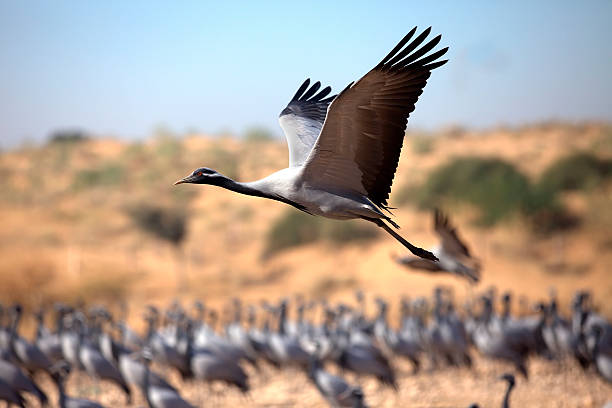

# Demoiselle Crane - Mongolia

## About

{width="552"}

The *Demoiselle Crane* (Grus virgo) is the smallest and one of the most elegant species of cranes. It's native to *Central Eurasia, it breeds in countries like **Mongolia, China, Kazakhstan, and parts of India, and migrates southward to** India and Africa* during winter.

Their most recognizable features are their *grey plumage, **black neck and chest feathers, and striking** white plumes extending from behind its eyes, the demoiselle crane is a symbol of beauty and resilience. Every year, these cranes undertake one of the most **challenging migrations, crossing the** Himalayas* at altitudes exceeding 16,000 feet, it's a feat that requires and highlights their endurance and adaptability.

In India, they are often seen in *Rajasthan and Gujarat*. Demoiselle cranes also play an important ecological role in maintaining grassland ecosystems by aiding seed dispersal and controlling insect populations.

```{r}
library(rnaturalearth)
library(rnaturalearthdata)
library(rnaturalearthhires)
library(tidyverse)
library(ggplot2)
library(ggformula)
library(tmap)
library(tmaptools)
library(tmap.mapgl)
library(osmdata)
library(sfheaders)
library(leaflet) 
library(leaflet)
library(leaflet.providers)
library(leaflet.extras)
library(threejs)
library(sf)
```

```{r}
cranes <- readr::read_csv("cranesmangolia.csv") %>% 
janitor::clean_names(case="snake")
cranes
```

```{r}
glimpse(cranes)
```

```{r}
crane_location <- cranes %>%
  select(location_long,location_lat)

glimpse(crane_location)
```

```{r}
visdat::vis_miss(crane_location)
```

```{r}
# https://boundingbox.klokantech.com/ CSV:
bbox_1 <- matrix(c(65.3,19.2,122.0,53.8), byrow = FALSE, nrow = 2,
    ncol = 2, dimnames = list(c("x", "y"), c("min", "max")))
bbox_1
```

```{r}
cranes_sf <- st_as_sf(cranes,
                      coords = c("location_long", "location_lat"),
                      crs = 4326)

```

```{r}
st_geometry(cranes_sf)
```

```{r}
craneslines <- st_read("lines.shp")
```

```{r}
cranespoints <- st_read("points.shp")
```

```{r}

migration_countries_1 <- World %>%
  filter(iso_a3 %in% c(
    "AFG", "CHN", "IND", "KAZ", "KGZ", 
    "MNG", "NPL", "PAK", "RUS", "TUR", 
    "TKM", "UZB"
  ))

# Plot with gf
gf_sf(migration_countries_1, fill = "grey", color = "black") %>%
  gf_point(data = cranes, location_lat ~ location_long, color = "violet", size = 1) %>%
  gf_labs(
    title = "Demoiselle Crane Migration Countries and Locations",
    x = "Longitude",
    y = "Latitude"
  )


```

```{r}

migration_countries <- World %>%
  filter(iso_a3 %in% c(
    "AFG", "CHN", "IND", "KAZ", "KGZ", 
    "MNG", "NPL", "PAK", "TUR", 
    "TKM", "UZB"
  ))

# Plot with gf
gf_sf(migration_countries, fill = "grey", color = "black") %>%
  gf_point(data = cranes, location_lat ~ location_long, color = "violet", size = 1) %>%
  gf_labs(
    title = "Zoom in -Demoiselle Crane Migration Countries and Locations",
    x = "Longitude",
    y = "Latitude"
  )


```

```{r}
gf_sf(migration_countries, fill = "grey", color = "black") %>%
gf_sf(data = craneslines, geometry = ~geometry, color = "darkblue", linewidth = 0.05) %>%
  gf_sf(data = cranespoints, geometry = ~geometry, color = "lightblue", alpha = 0.2, size = 0.5) %>%
  gf_theme(axis.text.x = element_text(angle = 45, hjust = 2)) %>%
  gf_labs(
    title = "CDemoiselle Crane Migration Countries and Locations ",
    subtitle = "Cranes Mangolia Study Source: Movebank"
  )
```

-   Inference

1.  Demoiselle Cranes move from northern Central Asia to South Asia. Most fixes cluster around Mongolia, China, and India. One outlier is far south.

2.  The biggest crowd of cranes is in India. Probably they go there during winter season.

```{r}
gf_sf(migration_countries, fill = "grey", color = "black") %>%
  gf_sf(data = craneslines, geometry = ~geometry, color = "white", linewidth = 0.05) %>%
  gf_point(data = cranes, location_lat ~ location_long, color = ~ground_speed, size = 0.5) %>%
  gf_labs(
    title = "Demoiselle Crane Migration with Ground Speed",
    x = "Longitude",
    y = "Latitude",
    color = "Ground Speed (m/s)"
  )

```

-Inference 1. The color of the dots shows their ground speed. Darker colors represents slower speed, and lighter shades represents faster speed.

2.  Most points are in darker shades. Thus, the cranes usually fly at slower speeds during migration.

```{r}
gf_sf(migration_countries, fill = "grey", color = "black") %>%
  gf_sf(data = craneslines, geometry = ~geometry, color = "white", linewidth = 0.05) %>%
gf_point(data = cranes, location_lat ~ location_long, color = ~height_above_ellipsoid) %>% 
    gf_labs(
    title = "Demoiselle Crane Migration with Height",
    x = "Longitude",
    y = "Latitude",
    color = "GHeight above ellipsoid"
  )
```

-Inference 1. They seems to fly high when they have to cross mountain otherwise, they fly flat and slow probably to save energy.

```{r}
gf_sf(migration_countries, fill = "grey", color = "black") %>%
  gf_point(data = cranes,location_lat ~ location_long, color = ~individual_local_identifier , size = 1)

```

```{r}
gf_sf(migration_countries, fill = "white", color = "black") %>%
  gf_line(data = cranes, location_lat ~ location_long, color = ~individual_local_identifier) %>%
    gf_point(data = cranes,location_lat ~ location_long, color = "black" , size = 0.2)
```

```{r}
print(craneslines)
plot(craneslines)
```

### Inferences

1.  Most cranes travel together.

2.  Each color is a different bird.

3.  Some birds take slightly different paths.

4.  A few birds stop at different places.
